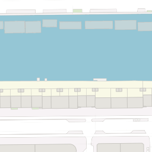
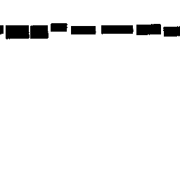
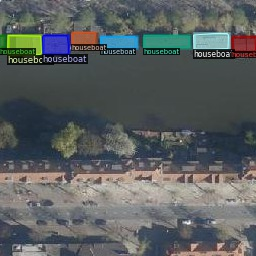
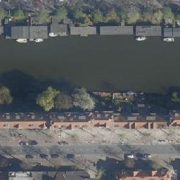
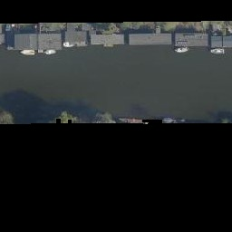

## Introduction
In this repository, an approach is implemented to detect and geolocate houseboats based on high resolution aerial/satellite images.  

For a quick dive into this repository take a look at the [Tutorial notebook](Tutorial.ipynb).

## Map tile structure
Information regarding the tile structure used at [data.amsterdam.nl](https://t1.data.amsterdam.nl/lufo2020_RD/13/3810/4315.jpeg) is available here: https://www.geonovum.nl/uploads/standards/downloads/nederlandse_richtlijn_tiling_-_versie_1.1.pdf

## Annotated dataset for houseboat detection
With the help of Key register Addresses and Buildings (in Dutch: Basisregistratie Adressen en Gebouwen, BAG) a dataset is created for houseboats by outlining their masks and adding corresponding class labels. BAG is a collection of base information about addresses and buildings in the Netherlands. The location and size of registered houseboats are also available in a topographic map created by BAG. In order to filter for houseboats in the image, we set a boundary as to which color needs to be detected. This results in black/white mask images. Next, we transform the mask images to MS COCO annotations (JSON files) using [this](https://github.com/chrise96/image-to-coco-json-converter) tool. The dataset of around 500 annotated images is available here: TODO

|  | | |
|:---:|:---:|:---:|

## Instance segmentation
To simplify the detection of houseboats, we overlay the satellite images with a non-water mask image. Using the mask, we avoid the detection of houses on land. The Python file [`create_water_only_tiles.py`](create_water_only_tiles.py) runs this part of the project.

|  | | |
|:---:|:---:|:---:|

Mask R-CNN is used for the detection and segmentation of houseboats in satellite images. An example Python file [`./models/test.py`](./models/test.py) is added to this repository to show how segmentation mask predictions can be converted to MS COCO polygon representations.

## Houseboat detection to Rijksdriehoek coordinates
A minimum bounding rectangle algorithm is used to calculate the width and length of a polygon. The sides of a minimum bounding rectangle minimally enclose the more complex polygon shape. The width and length of the rectangle in pixels are converted to Rijksdriehoek coordinates. Also, the center of the polygon is calculated in pixels and converted to Rijksdriehoek coordinates.

## Output
The system was evaluated on a dataset of 37.621 (~16.000 water-only) satellite images captured in 2020. The estimated latitude and longitude location data of houseboats in Amsterdam can be found here: [`./output/houseboat_locations_2020_latlng.csv`](./output/houseboat_locations_2020_latlng.csv). The csv file with latitude and longitude locations can directly be imported in Google's [My Maps](https://www.google.com/maps/d/). Note that a max of only 2000 rows can be imported in one layer in Google's My Maps. A more detailed output (with columns: XY tile name, polygon in pixel values, center of polygon in Rijksdriehoek coordinates, width and length of polygon in meters) can be found here: [`./output/houseboat_polygon_data.csv`](./output/houseboat_polygon_data.csv).
